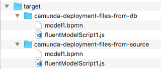

# Camunda Unit Test Helpers for Groovy

Camunda BPM Unit Test Helpers for writing unit tests in Groovy

# How it works

The helpers are implemented within a Groovy Trait.  You can add the trait to your unit test classes such as:

```groovy
import io.digitalstate.camunda.unittest.UnitTestingHelpers
class FluentApiBuilderFeatureSpec extends Specification implements UnitTestingHelpers{
...
}

```

Where the `UnitTestingHelpers` is the trait.

Once the trait is implemented there are several methods and core features that become 
available to make unit testing for Camunda simpler and faster to get started with 
less code :exclamation:

# Usage

## `setDeploymentFiles(...)`

The `setDeploymentFiles()` is designed to simplify deployments into the Camunda engine.  
The method expects a Map<String,Object> that will support type types of objects: 
1. A String/Text path to a file to deploy, and 
1. a BpmnModelInstance that will be deployed.

This helper exists in its format because it tends to be the two most common formats, and if it is not the format you need, you can access the DeploymentBuilder provided by Camunda once you call `setupDeployment()`

Example:

```groovy
...
// setDeploymentFiles() detects if the values are Strings or BpmnModelInstances
// and executes the proper parsing.
// If the value is a String it expects that the String is a Path to the file.
setDeploymentFiles([
    'model1.bpmn': model3(),
    'fluentModelScript1.js': '/bpmn/fluentModelScript1.js'
])
...
```

The `setDeployment()` is typically called within the setup() or setupSpec parts of 
the unit testing.

Notice how there are two parts of the Map: The File Name and the Model Instance/or file path.  
The File Name is provided as a way to have custom file deployment names rather than be 
subject to the file's actual name.  This is useful for when dealing with Multi-Environment 
deployments where you may be deploying a Test,Stage,Prod scenario, where you local files 
might be name-spaced, but the BPMN always expects the same constant filename.

## `setupDeployment()` and `setupDeployment().deployNow()`

`setupDeployment()` will take the files that were added with the `setDeploymentFiles()` 
and prep them for deployment.  The method will return the Camunda DeploymentBuilder, 
allow you to access other DeploymentBuilder Methods as you see fit 
(such as manually adding additional deployment resources).  There are two arguments for the method:
`setupDeployment(String deploymentName = 'FluentModelBuilder', duplicateFiltering = false)`.  
Sensible defaults are set, but you can override as you see fit, or change with 
the DeploymentBuilder.

Once you are ready to deploy, you can use the normal Camunda DeploymentBuilder `.deploy()` 
method.  But we find that there is a extra step typically required: Once you deploy, 
you want to know the DeploymentId for future use in the Unit Test (such as deleting the 
deployment).  Therefore a extra helper method is provided: `.deployNow()`.  
This method is dynamically injected into the DeploymentBuilder, and thus can only be 
called once you use `setupDeployment()`.  You can chain the methods as well.

You can get the deploymentFiles Map with `getDeploymentFiles()`

Example Usage:

```groovy
...
def setupSpec(){
    // setDeploymentFiles() detects if the values are Strings or BpmnModelInstances
    // and executes the proper parsing.
    // If the value is a String it expects that the String is a Path to the file.
    setDeploymentFiles([
        'model1.bpmn': model3(),
        'fluentModelScript1.js': '/bpmn/fluentModelScript1.js'
    ])

    // deployNow() is a new method that has been injected into the metaclass
    // when setupDeployment() was executed.  deployNow() does the same as deploy()
    // but it also adds the deploymentId value into the Unit Test Helpers
    // to save the developer a extra step.
    setupDeployment().deployNow()
}
...
```

## SharedData

During unit testing, there is lots of data collected during the test that is 
typically used across methods, classes, and tests.  To help simplify the needed code 
and boilerplate a `sharedData` Map<String,Object> is provided.

helper methods are provided to make the usage as clean as possible:

1. `getSharedData()`
1. `getSharedData(String key)` : Returns the value in SharedData from a specific key.
1. `setSharedData(Map<String, Object> sharedData)` : Overwrites Shared Data.
1. `addSharedData(Map<String, Object> sharedData)` : Appends the content of a Map<String, Object> to the existing Shared Data.
1. `addSharedData(String key, Object value)` : Appends a specific Key/Value paid into the Shared Data Map.

SharedData Get and Set could be used at any point in the unit testing.  It is designed to be highly 
flexible, and its purpose is to reduce the amount of "extra" framework specific knowledge that is 
required.

Example usage:

```groovy
...
def cleanupSpec() {
     // Several SharedData methods are provided to add data into a static space for reuse
     // This saves a step of having to build a @Shared variable in the Unit Test's Class
    String deploymentId = getSharedData('deploymentId')
...
}
...
```

## exportDeploymentFromCamundaDB()

Exports the deployment resources that were put into the Camunda DB and saves them into the build/target folder (`target/camunda-deployment-files-from-db`)
The files were downloaded directly from the database used in the unit test.  
This method is helpful when you want to visually inspect the deployment files that were stored in 
the database.  This can be a need when you have deployment resources that are being modified during 
deployment or by the Engine during the parse phase.

The default configuration uses the deploymentId value within SharedData Map.  
If you want to manually provide a DeploymentID (in scenarios such as customizations or multiple 
deployments), you can provide the deploymentId as part of the 
method arguments: `exportDeploymentFromCamundaDB(someDeploymentId)`.

The typical usage for this method is at the cleanup stages / end of unit tests.  

Example usage:

```groovy
...
def cleanupSpec() {
    exportDeploymentFromCamundaDB()

    repositoryService().deleteDeployment(deploymentId,
            true, // cascade
            true, // skipCustomListeners
            true) // skipIoMappings
    println "Deployment ID: '${deploymentId}' has been deleted"
}
...
```

### Camunda Model Fluent API

Camunda provides a Model Fluent API, which allows you to build a BPMN model using a code based 
Fluent API.  The `exportDeploymentFromCamundaDB()` is especially helpful when you are building a 
fluent API, testing it with the Camunda Engine, and then want the .bpmn file to continue work 
in Camunda Modeler or just to provide a sanity check during development (The visual 
image is often helpful to understand what mistakes you made in the configuration of the Fluent API, 
especially for parallel and large processes.)

# exportDeploymentFromSource()

Similar to the `exportDeploymentFromCamundaDb()`, but it will use the original source resources 
from the deploymentFiles Map that were populated by the `setDeploymentFiles()` method.

The default configuration uses the Map from DeploymentFiles.  But you can also provide a custom 
Map<String, String> of resources to save.  The Map will use the Key as the filename 
(`someProcess.bpmn`), and the the Value will be the contents of the file.


Example usage:
```groovy
...
def cleanupSpec() {
    exportDeploymentFromSource()

    repositoryService().deleteDeployment(deploymentId,
            true, // cascade
            true, // skipCustomListeners
            true) // skipIoMappings
    println "Deployment ID: '${deploymentId}' has been deleted"
}
...
```

Both the `exportDeploymentFromSource()` and `exportDeploymentFromCamundaDB()`
can be used within the unit test if you wish to export both sets of files.  
Typically used in scenarios where you want to compare original source with the final deployment files.

Example usage:

```groovy
def cleanupSpec() {
    // Several SharedData methods are provided to add data into a static space for reuse
    // This saves a step of having to build a @Shared variable in the Unit Test's Class
    String deploymentId = getSharedData('deploymentId')

    // These two methods give you choice about which deployment to save into the build/target directory.
    // fromCamundaDB will use the deployment files saved into the DB.  Generally you dont want this
    // when using with tools such as Coverage Generation because the BPMN will not be the
    // original, but rather a modified version.
    // The FromSource uses the original un-modified files provided in the setDeploymentFiles() method.
    exportDeploymentFromCamundaDB()
    exportDeploymentFromSource()

    repositoryService().deleteDeployment(deploymentId,
            true, // cascade
            true, // skipCustomListeners
            true) // skipIoMappings
    println "Deployment ID: '${deploymentId}' has been deleted"
}
```

Which would generate:



# How to Install

Add JitPack as a repository source in your build file:

If you are using Maven, then add the following to your pom.xml

```xml
<project>
...
    <repositories>
        <repository>
            <id>jitpack.io</id>
            <url>https://jitpack.io</url>
        </repository>
    </repositories>
...
```

This snippet will enable Maven dependency download directly from Github.com

Then add the following dependency:

```xml
...
 <dependency>
    <groupId>com.github.digitalstate</groupId>
    <artifactId>camunda-unit-test-helpers-groovy</artifactId>
    <version>v0.5</version>
    <scope>test</scope>
 </dependency>
 ...
 ```

Note that: Groovy, camunda-bpm-assert are dependencies.


# Full Example using Spock Framework

```groovy
package fluentapitest

import io.digitalstate.camunda.unittest.UnitTestingHelpers
import org.camunda.bpm.engine.runtime.ProcessInstance
import org.camunda.bpm.engine.test.ProcessEngineRule
import org.junit.ClassRule
import spock.lang.Shared
import spock.lang.Specification
//brings in Camunda BPM Assertion + AssertJ core.api.Assertions
// http://joel-costigliola.github.io/assertj/core/api/index.html
// http://camunda.github.io/camunda-bpm-assert/apidocs/org/camunda/bpm/engine/test/assertions/ProcessEngineTests.html
// http://joel-costigliola.github.io/assertj/
import static org.camunda.bpm.engine.test.assertions.ProcessEngineAssertions.assertThat
import static org.camunda.bpm.engine.test.assertions.ProcessEngineTests.repositoryService
import static org.camunda.bpm.engine.test.assertions.ProcessEngineTests.runtimeService

class FluentApiBuilderFeatureSpec extends Specification implements BpmnFluentBuilder, UnitTestingHelpers {

    @ClassRule
    @Shared ProcessEngineRule processEngineRule = new ProcessEngineRule('camunda_config/camunda.cfg.xml')

    def setupSpec(){
        // setDeploymentFiles() detects if the values are Strings or BpmnModelInstances
        // and executes the proper parsing.
        // If the value is a String it expects that the String is a Path to the file.
        setDeploymentFiles([
            'model1.bpmn': model3(),
            'fluentModelScript1.js': '/bpmn/fluentModelScript1.js'
        ])

        // deployNow() is a new method that has been injected into the metaclass
        // when setupDeployment() was executed.  deployNow() does the same as deploy()
        // but it also adds the deploymentId value into the Unit Test Helpers
        // to save the developer a extra step.
        setupDeployment().deployNow()
    }

    def 'Testing Fluent API Builder'() {
        when: 'Creating a instance of model1 process definition'
            ProcessInstance processInstance = runtimeService().startProcessInstanceByKey('model')

        then: 'Process is Active'
            assertThat(processInstance).isActive()
    }

    def cleanupSpec() {
        // Several SharedData methods are provided to add data into a static space for reuse
        // This saves a step of having to build a @Shared variable in the Unit Test's Class
        String deploymentId = getSharedData('deploymentId')

        // These two methods give you choice about which deployment to save into the build/target directory.
        // fromCamundaDB will use the deployment files saved into the DB.  Generally you dont want this
        // when using with tools such as Coverage Generation because the BPMN will not be the
        // original, but rather a modified version.
        // The FromSource uses the original un-modified files provided in the setDeploymentFiles() method.
        exportDeploymentFromCamundaDB()
        exportDeploymentFromSource()

        repositoryService().deleteDeployment(deploymentId,
                true, // cascade
                true, // skipCustomListeners
                true) // skipIoMappings
        println "Deployment ID: '${deploymentId}' has been deleted"
    }
}

```

The `BpmnFluentBuilder` trait is a helper file for this example to remove the Fluent API code.  
This is the trait's content:

```groovy
package fluentapitest

import org.camunda.bpm.model.bpmn.Bpmn
import org.camunda.bpm.model.bpmn.BpmnModelInstance

trait BpmnFluentBuilder {

    BpmnModelInstance model1(){
        BpmnModelInstance model = Bpmn.createExecutableProcess('model')
        .startEvent()
        .scriptTask()
            .name('Some Simple Script')
            .scriptFormat('javascript')
            .camundaResource('deployment://fluentModelScript1.js')
        .userTask()
            .name('placeholder')
        .endEvent()
        .done()

        return model
    }

    BpmnModelInstance model2(){
        BpmnModelInstance model = Bpmn.createExecutableProcess('model')
                .name("Reminder Demo")
                .startEvent()
                .userTask('readEmail')
                    .boundaryEvent()
                        .timerWithDuration("PT1H")
                        .cancelActivity(false)
                        .manualTask()
                            .name('do something')
                        .endEvent()
                        .moveToActivity('readEmail')
                .boundaryEvent()
                    .timerWithCycle("R3/PT10M")
                    .manualTask()
                        .name('do something else')
                    .endEvent()
                    .moveToActivity('readEmail')
                .endEvent()
                .done()
        return model
    }

    BpmnModelInstance model3(){
        BpmnModelInstance model = Bpmn.createExecutableProcess('model')
                .name("Reminder Demo")
                .startEvent()
                .userTask('readEmail')
                    .boundaryEvent('killusertask')
                    .timerWithDuration("PT1H")
                    .cancelActivity(true)
                    .moveToActivity('readEmail')
                .boundaryEvent()
                    .timerWithCycle("R3/PT10M")
                    .cancelActivity(false)
                    .serviceTask()
                        .name('reminderSent')
                        .implementation('expression')
                        .camundaExpression('${1+1}')
                    .endEvent()
                    .moveToActivity('readEmail')
                .manualTask('manual1').name('do something')
                .moveToNode('killusertask').connectTo('manual1')
                //.moveToActivity('killusertask').connectTo('manual1') This does not work. Must use the moveToNode()
                .manualTask('manual2').name('do something else')
                .endEvent()
                .done()
        return model
    }


    BpmnModelInstance model4(){
        BpmnModelInstance model = Bpmn.createExecutableProcess('model')
                .startEvent()
                .subProcess()
                    .embeddedSubProcess()
                    .startEvent()
                    .manualTask()
                    .userTask("placeOrders")
                        .name("Place your order at: 1234")
                        .camundaAssignee("someUser")
                        .boundaryEvent("killUserTask")
                            .timerWithDuration("PT1H")
                            .cancelActivity(true)
                            .moveToActivity("placeOrders")
                        .boundaryEvent()
                            .timerWithCycle("R3/PT10M")
                            .cancelActivity(false)
                            .manualTask("reminderIfNeeded")
                            .endEvent()
                            .moveToActivity("placeOrders")
                    .serviceTask("timesUpOrOrderComplete")
                        .name("timesUpOrOrderComplete")
                        .implementation("expression")
                        .camundaExpression("\${1 + 1}")
                    .moveToNode("killUserTask").connectTo("timesUpOrOrderComplete")
                    .endEvent()
                .subProcessDone()
                    .multiInstance()
                    .parallel()
                    .camundaCollection("#{gettingLunch}")
                    .camundaElementVariable("lunchGetter")
                    .multiInstanceDone()
                .endEvent()
                .done()
        return model
    }

}
```